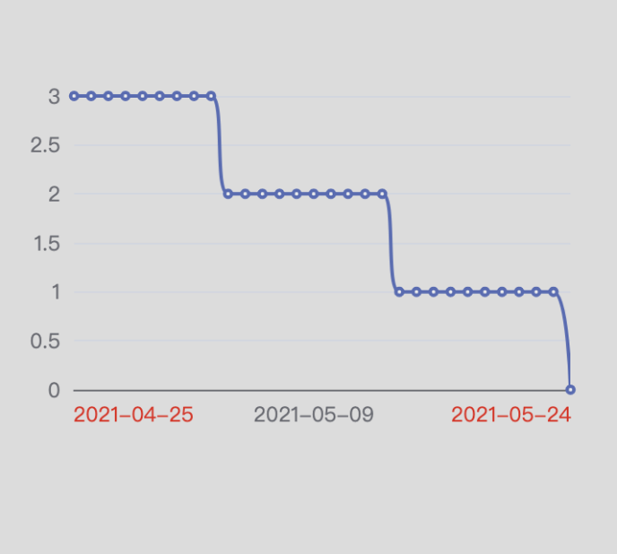

# 项目简介

该项目为 使用 echarts 时碰到的一些比较难实现的效果记录，供后续翻阅

## X 轴部分

1.  时间 x 轴分个固定份，且展示居中
    效果如下图
    
    [实现代码](./src/XAxisCenter/index.jsx)

## Y 轴部分

1. 双 y 轴实现刻度对齐

## 折线图

1. 实现渐变面积

## Tooltip 部分

1. 手动控制 axisPointer 显隐
